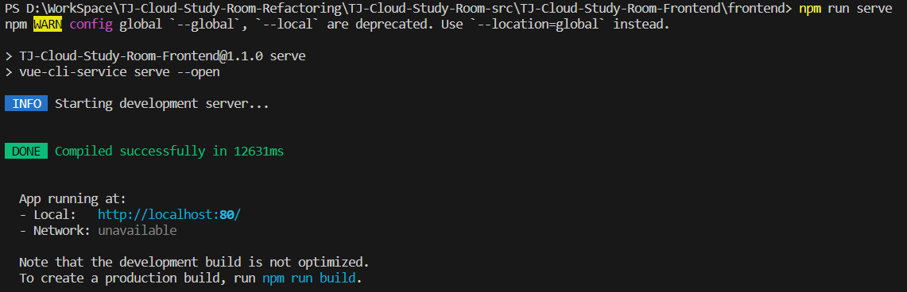
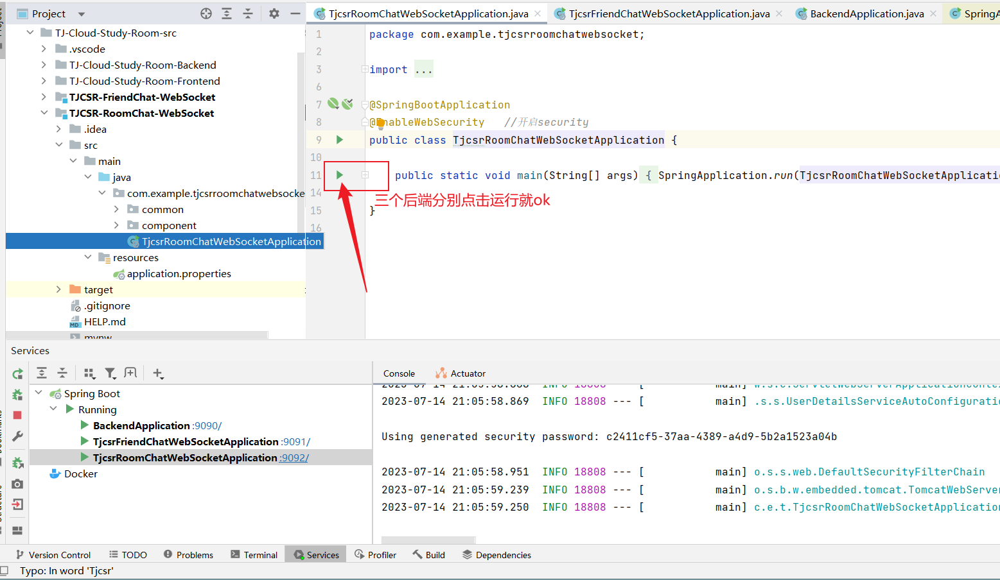
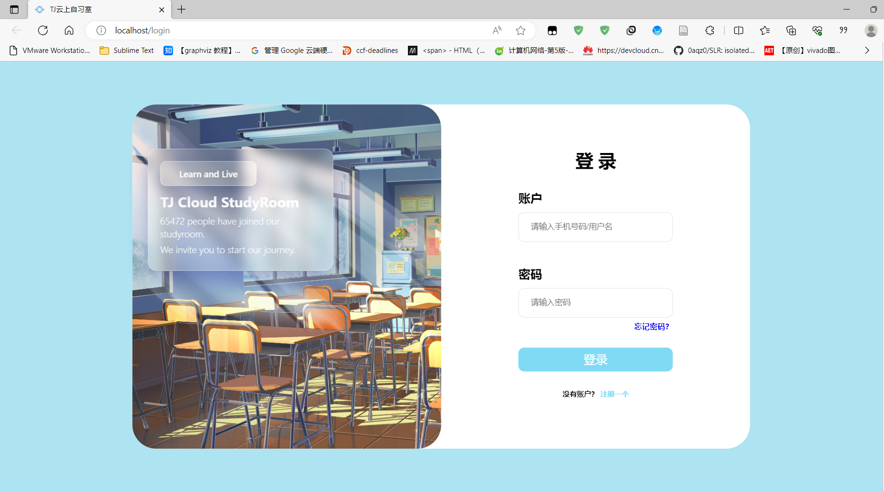
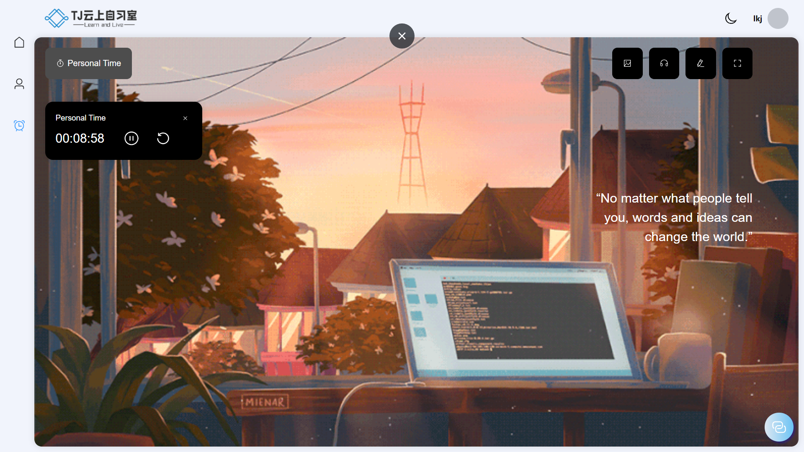

# TJ-Cloud-Study-Room-Refactoring
同济云上自习室重构


源项目前端git：git@codehub.devcloud.cn-north-4.huaweicloud.com:TJyszxs00001/TJ-Cloud-Study-Room-Frontend.git

源项目后端git：git@codehub.devcloud.cn-north-4.huaweicloud.com:TJyszxs00001/TJ-Cloud-Study-Room-Backend.git


## 使用说明：

```powershell
git clone https://github.com/qbdl/TJ-Cloud-Study-Room-Refactoring.git
```

前端(可以使用VSCode)：

```powershell
cd .\TJ-Cloud-Study-Room-src\TJ-Cloud-Study-Room-Frontend\frontend\
npm install
npm run serve
```



后端（三个后端,建议使用 [IntelliJ IDEA](https://www.jetbrains.com/idea/) ）：

```
直接在IntelliJ IDEA里运行即可
```




## 运行效果：

<center class="half">    
        
     
</center>

<center class="half">    
        
     
</center>


## 补充：mvn与jdk安装说明

#### jdk安装：

[(47条消息) jdk17下载与安装教程（win10），超详细_bestsongs的博客-CSDN博客](https://blog.csdn.net/bestsongs/article/details/122939081)

#### mvn安装：

[Maven 专题（一）：Maven 安装与配置（vscode） - 秋华 - 博客园 (cnblogs.com)](https://www.cnblogs.com/qiu-hua/p/13229363.html)
